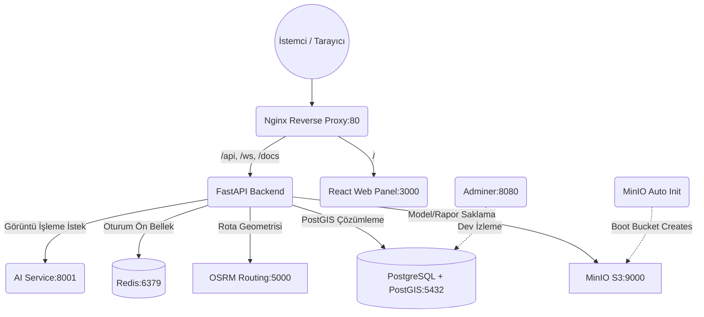

# Docker Servis Diyagramı

```mermaid
graph TD
    Client((İstemci / Tarayıcı)) --> Nginx(Nginx Reverse Proxy:80)
    
    Nginx -->|/api, /ws, /docs| Backend(FastAPI Backend)
    Nginx -->|/| Frontend(React Web Panel:3000)
    
    Backend -->|Model/Rapor Saklama| Minio[MinIO S3:9000]
    Backend -->|Rota Geometrisi| OSRM[OSRM Routing:5000]
    Backend -->|PostGIS Çözümleme| Postgres[(PostgreSQL + PostGIS:5432)]
    Backend -->|Oturum Ön Bellek| Redis[(Redis:6379)]
    Backend -->|Görüntü İşleme İstek| AI(AI Service:8001)
    
    Adminer(Adminer:8080) -.->|Dev İzleme| Postgres
    MinioInit(MinIO Auto Init) -.->|Boot Bucket Creates| Minio
```
